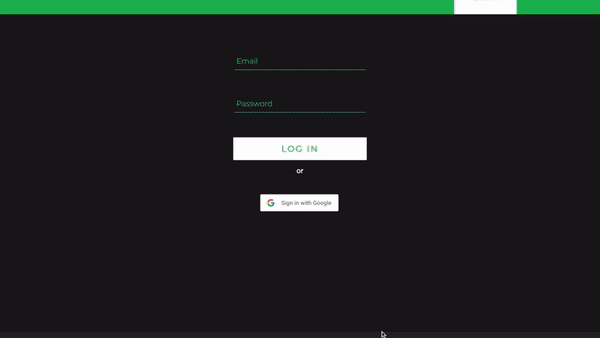

# Music Journal

### Project Description

We share musics a lot on social media platforms like Instagram stories, to record the songs we like or to document our feelings at that moment.

I want to create a social media for people to share the music they like, comment on songs they like, record their days and lives via music, like writing a journal using music rather than words.

### Features

* uses Firebase to store all the data and for user authentification
* Users can
	* Signup/Login/Logout
	* Search for a song and make a post
	* See history posts and delete a post
	* View, comment and like other peoples' posts
	* Upload profile image and change username
	* Visit other peoples' account home page
* Backend API I wrote for this project:
	* [https://github.com/sm7515/music-journal-node-api](https://github.com/sm7515/music-journal-node-api)

### Link:

[https://musicjournal.herokuapp.com/](https://musicjournal.herokuapp.com/)

_feel free to create an account and play with it!_

### Demo:

